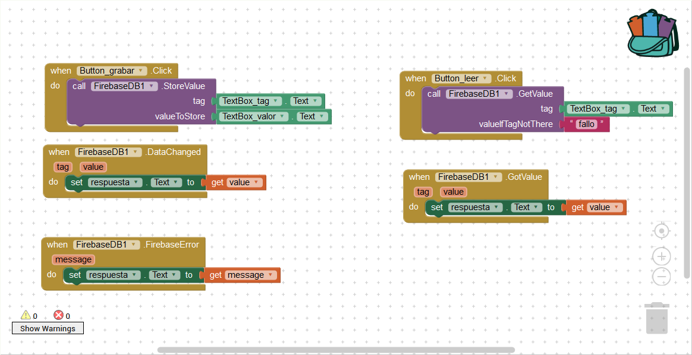
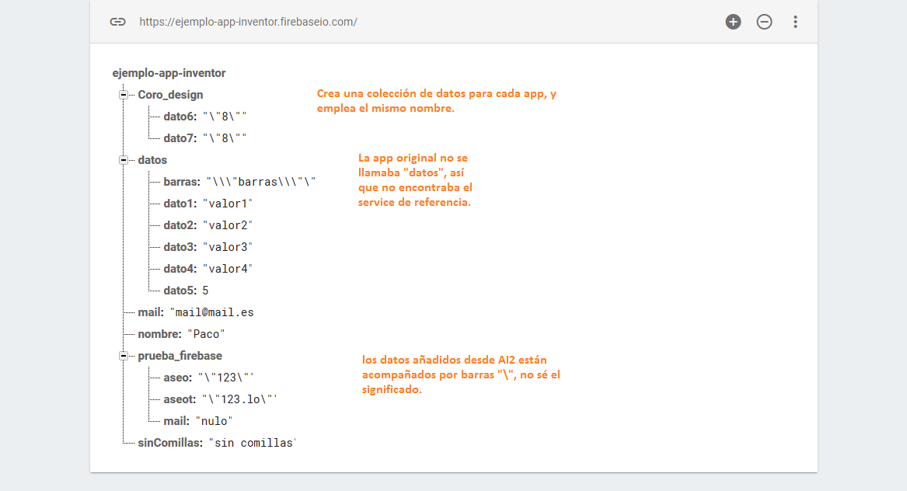

Apuntes sobre App Inventor 2

Un lugar para recopilar lo que aprendo (y no quiero olvidar ;) ) sobre AI2.

## Firebase module (experimental)
Por fin funcionó. Describo los pasos que hice, al ver que nada permitía consultar los datos grabados en Firebase.  
Primero, desde JS, probé el acceso a la BD en Firebase 'https://ejemplo-app-inventor.firebaseio.com/', y comprobé que era posible leer y escribir.  
Después, creé una nueva app, para grabar pares tag-valor, y leer valores a partir de una tag. Usé la BD DEFAULT, y funcionó.  
Entonces sustituí la app Default por la mía, grabé y leí: funcionó. Al mirar la estructura desde la consola de Firebase, me encontré con lo siguiente: la BD crea un service para la app, con su nombre, y es ahí donde se escriben y leen los datos.  
Al añadir, desde la consola, nuevos pares tag-valor, es posible acceder a ellos desde la app, correctamente.  
Posteriormente, desde Coro_design, eliminé el componente FirebaseDB1, y añadí uno nuevo. Grabé un dato, y luego todo funcionó como en la app de prueba. Al ver la estructura de datos, se comprende que firebase crea una estructura service-datos para cada App que accede a ella desde App Inventor 2.  
Así que las **conclusiones** a las que llego son:  
- Es posible usar Firebase desde AI2,  
- se puede alimentar una base con datos desde la consola, importando datos, o añadiéndolos,  
- la estructura de datos hay que pensarla bien, antes de generalizar a una app de coro (o similar), donde (supuestamente) tendríamos varias colecciones de datos y muchos usuarios accediendo a las distintas colecciones.  
Bloques: 
Estructura de Firebase:   

Fuentes de información para configurar (a ver si consigo que arranque y escribo cómo hacerlo).
* https://rominirani.com/tutorial-mit-app-inventor-firebase-4be95051c325
* http://dl.qyv.me/ownfirebase/
* https://www.youtube.com/watch?v=BWUDp2HjhCQ

