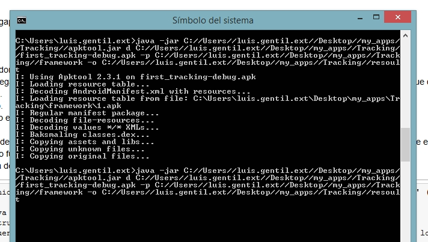

# Apuntes de Phonegap

(hay algunas referencias en (hay algunas referencias en otro fichero de apuntes, por ejemplo https://github.com/luisgentil/apuntes/blob/master/Html-CSS-Javascript.md#css-b%C3%A1sico).

### Herramienta apktool

Para comprobar el contenido del android.manifest de un apk necesitamos una herramienta de reingeniería, llamada 'apktool' (muy original,...).  
Hace falta Java 1.7 o +.  
Pruebo a seguir las instrucciones de instalación ( https://ibotpeaches.github.io/Apktool/install/).  
Funciona, teniendo en cuenta que:  
- hay que usar las rutas completas,  
- hay que crear un directorio para almacenar los archivos del framework,  
- y hay que especificar una carpeta para que guarde los ficheros resultantes, carpeta que no debe existir o bien especificar -f para que sobreescriba.  
  

### media plugins para phonegap
Para que funcionen las apps con cámara, hace falta especificar plugins correctamente.  
Encontré una referencia a dos 'nuevos' plugins en el blog de PhoneGap, uno para el stream de vídeo, otro para grabar imágenes y vídeo (PhoneGap Image Capture Plugin).  
La entrada del blog: https://blog.phonegap.com/release-of-phonegap-media-stream-d53e5a5bfbf6   
Resulta muy interesante ese blog, por cierto; tiene referencias que habrá que revisar en el futuro: push notifications, y cosas así.  
Añadí el plugin a xml, y ya **SÍ FUNCIONA**  
